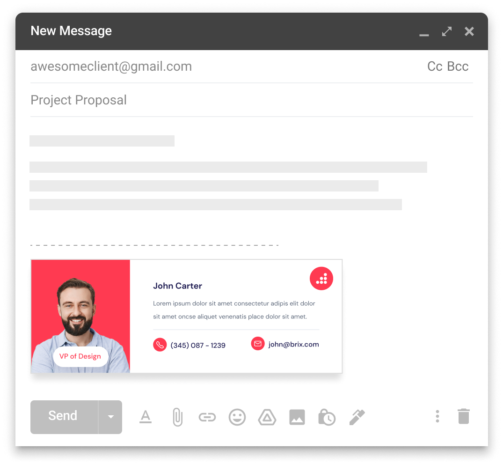

## Create Email Signatures for Free

---

[EmailSignature](emailsignature.in) is a free tool to create HTML signatures for Gmail. HTML email signatures allow you to create professional signatures for free without requiring any know-how of code.

Visit [emailsignature.in](https://emailsignature.in) to start creating your email signature.

---

## How to Use

1. **Select a Template**:
   - Choose a template that best suits your style and professional needs.

2. **Fill in Your Details**:
   - Enter your personal and professional information in the form provided.
   - Customize your signature with your name, job title, contact information, and social media links.

3. **Preview Your Signature**:
   - See a real-time preview of your email signature as you fill in the details.
   - Make adjustments as needed to perfect your signature.

4. **Copy Your Signature**:
   - Once you're satisfied with your signature, click the "Copy Signature" button.
   - The generated HTML will be copied to your clipboard.

5. **Paste in Gmail**:
   - Follow the tutorial link provided to learn how to paste your signature into Gmail settings.

---

Thank you for using the Email Signature Generator!