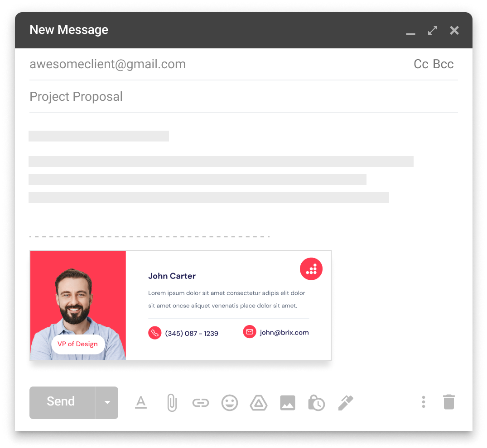

## Email Signature Generator



A mobile-first React app for generating copy-ready HTML signatures for Gmail.

## What changed

- **Unified design system**: shared UI primitives in `src/components/ui/*` and Tailwind theme tokens for spacing, radius, touch targets, and brand colors.
- **Template registry architecture**: templates are now registered in `src/templates/registry.js` and rendered via React components in `src/templates/SignatureTemplate.js`.
- **Single adapter mapping**: form data is normalized in `src/templates/adapter.js` before rendering.
- **Responsive editor flow**: `/editor` now follows a mobile-first sequence (template selection → form editing → live preview → copy action).
- **Legacy text templates removed**: old `public/templates/template_*.txt` placeholder files are no longer used.

## Routes

- `/` - landing page with mobile-first hero layout.
- `/editor` - responsive template picker + form editor + preview + copy.

## Local development

```bash
npm install
npm start
```

## Usage

1. Choose a template.
2. Fill personal/company/styling/social fields.
3. Review live preview.
4. Click **Copy Signature**.
5. In Gmail: **Settings → See all settings → Signature**, create a new signature, and paste.
